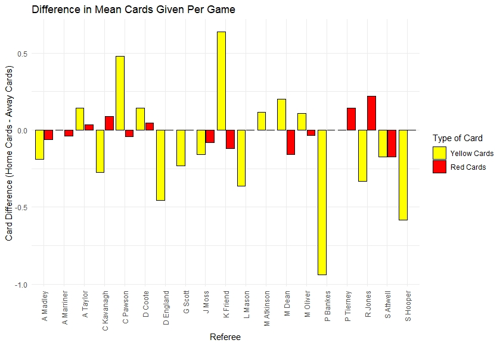

# Football-Data-Analysis
Analysing football (soccer) data using software such as R and Python.

##Premier League 2021-2021 Data: Cards Given By Referees
Using a CSV file of Premier League Data from http://www.football-data.co.uk , I aggregated the yellow/red card data for each referee (both home games and away games), and joined these variables together into a datframe. From this, I calculated the differences in cards dished out in home games vs. away games for each referee. After melting the data into long format, I plotted these differences using ggplot.

#### Figure 1: A plot showing the differences in home cards vs. away cards given out for each referee in the 2020-2021 English Premier League Season.
