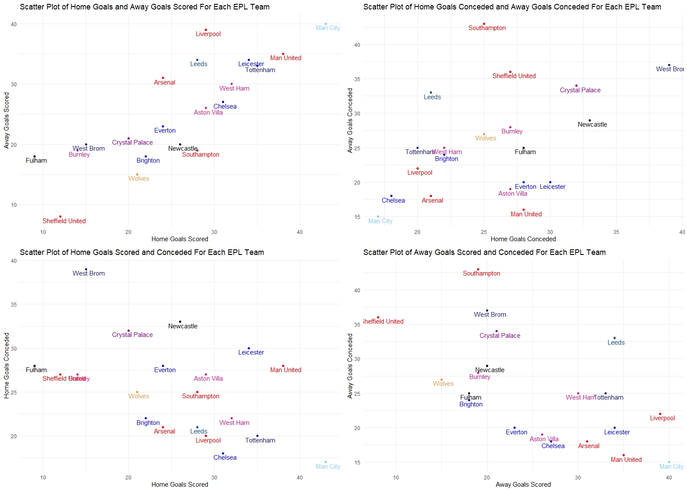

# Football-Data-Analysis
Analysing football (soccer) data using software such as R and Python.

## Premier League 2021-2021 Data: Cards Given By Referees
Using a CSV file of Premier League Data from http://www.football-data.co.uk , I aggregated the yellow/red card data for each referee (both home games and away games), and joined these variables together into a datframe. From this, I calculated the differences in cards dished out in home games vs. away games for each referee. After melting the data into long format, I plotted these differences using ggplot.

#### Figure 1: A plot showing the differences in home cards vs. away cards given out for each referee in the 2020-2021 English Premier League Season.

From this, we can see that Peter Bankes gave out almost 1 more yellow card per game on average to the away team, compared to the home team. In contrast, Kevin Friend gave away considerably more yellow cards to the home team than to the away team on average (approximately 0.6 cards per game). The difference between red cards given out is considerably smaller than yellow cards, as far fewer red cards are given out on average compared to yellow cards (looking at the data we extracted shows that some referees gave out no red cards for the entire 2020-2021 season).

## Premier League 2021-2021 Data: Goals Scored/Conceded By Teams
I aggregated the home and away goals scored/conceded for each team and then plotted them using ggplot, coloured by team colour. The four plots that I decided to plot were the relationship between home and away goals scored, the relationship between home goals conceded and away goals conceded, the relationship between home goals scored and conceded, and the relationship between away goals scored and conceded. The correlation matrix below shows the relationship between each variable:

|              |Home Goals| Away Goals| Home Conceded| Away Conceded
|          ----|-------------|----------|-------------|----------
|Home Goals     |    1.00    |   0.81   |     -0.49   |     -0.52
|Away Goals     |    0.81    |   1.00   |     -0.48   |     -0.59
|Home Conceded   |   -0.49    |  -0.48   |      1.00   |      0.43
|Away Conceded   |   -0.52    |  -0.59   |      0.43   |      1.00

This shows that the strongest correlation is between the amount of home goals scored by a team and the amount of away goals scored by a team, at 0.81. This would be expected, as in general teams who score lots of home goals would also be expected to score lots of away goals. However, it is surprising that the correlation between home goals conceded and away goals conceded is only 0.43, as you'd expect teams to have fairly similar defensive records both at home and away. However, you can see from the top-right plot in Fig. 2 that teams such as Southampton and Leeds have considerably worse defensive records in away games than at home, which could explain this (Southampton lost 9-0 away to Man. United which contributed significantly to their goals conceded).

We can also see that there are negative correlations between the amount of goals scored and conceded by a team, as expected - in general, better teams score more goals and concede fewer goals, and vice versa.

#### Figure 2: Scatter plots showing the relationships between home/away goals scored/conceded for each EPL team (colour corresponds to each team colour).

